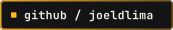
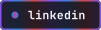
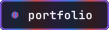
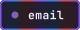

<picture>
  <source media="(prefers-color-scheme: dark)" srcset="assets/profile-dark.svg" />
  
</picture>

  
  
  
  

The card above is one animated SVG, composed from React components and refreshed from the GitHub API daily by <a href="src/render-all.tsx">the build in <code>src/</code></a>. The badges repeat its contact links because an SVG behind an <code>&lt;img&gt;</code> cannot be clicked. See <a href="NOTES.md">NOTES.md</a> for how it is put together.
