  <picture>
    <source media="(prefers-color-scheme: dark)" srcset="assets/profile-dark.svg" />
    <source media="(prefers-color-scheme: light)" srcset="assets/profile-light.svg" />
    
  </picture>

  
  &nbsp;&nbsp;
  
  &nbsp;&nbsp;
  
  &nbsp;&nbsp;
  

