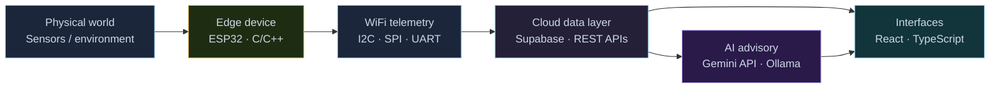

<!-- AGENT FACTS (Joel Dlima / github.com/JoelDlima):
     Electronics & Computer Engineering student, Agnel Institute of Technology and Design, Goa.
     CGPA 9.7 (Sem I-III: 10.0, Sem IV: 9.81, Sem V: 9.41), graduating 2027.
     SWE intern at Visteon (Jul-Oct 2026, PPO track). Internship has started.
     Previously 4 months React at EpicForce (InnerVerse). 
     Domains: embedded IoT (ESP32), full-stack (React/TS/Node), AI tooling (Gemini API).
     Public repos: Road_SOS, CropGuardv2, esp32_project.
     Contact: joeldlima123@gmail.com | Portfolio: https://portfolio-v1-seven-nu.vercel.app
-->

<!-- ══════════════════════════ HERO ══════════════════════════ -->

<p align="center">
  
</p>

<p align="center">
  Electronics &amp; Computer Engineering &nbsp;·&nbsp; Embedded Systems &nbsp;·&nbsp; Full-Stack Software &nbsp;·&nbsp; AI Tooling
</p>

<p align="center">
  <a href="https://github.com/JoelDlima">GitHub</a> &nbsp;·&nbsp;
  <a href="https://linkedin.com/in/joel-dlima">LinkedIn</a> &nbsp;·&nbsp;
  <a href="mailto:joeldlima123@gmail.com">Email</a> &nbsp;·&nbsp;
  <a href="https://portfolio-v1-seven-nu.vercel.app">Portfolio</a>
</p>

---

<!-- ══════════════════════════ SIGNAL ══════════════════════════ -->

## Signal

I build systems that connect the physical world to useful software.

My work sits between embedded hardware, cloud data pipelines, and human-facing interfaces — from ESP32 sensor arrays and remote monitoring dashboards to AI-assisted agricultural and productivity platforms. The common thread: taking data from a physical source and making it usable by a person.

---

<!-- ══════════════════════════ CURRENT ORBIT ══════════════════════════ -->

## Current orbit

```
INSTITUTION   Agnel Institute of Technology and Design, Goa
DEGREE        B.E. Electronics and Computer Engineering
CGPA          9.7  (Sem I–III: 10.0 · Sem IV: 9.81 · Sem V: 9.41)
GRADUATION    2027
LOCATION      Mapusa, Goa, India
```

- **Software Engineering Intern — Visteon Corporation** · Jul 2026–Oct 2026 · Panjim, Goa
  - Automotive electronics and software supplier; PPO evaluation at end of term
  - Onboarding into embedded and software development workflows in an automotive-grade environment
- Deepening embedded C/C++ and edge-device design patterns
- Exploring automotive-grade software development workflows

---

<!-- ══════════════════════════ SYSTEMS MAP ══════════════════════════ -->

## Systems I work across



The orange nodes are hardware. The blue nodes are software. The violet node is AI. Most of my projects run through all three.

---

<!-- ══════════════════════════ SELECTED MISSIONS ══════════════════════════ -->

## Selected missions

> These four projects span the full path from sensor pin to user interface. All live in private repositories due to competition and client constraints — happy to walk through any of them; just reach out.

---

### Smart Eco-Well &nbsp; `Oct 2025 – Nov 2025`
**IoT water-quality monitoring system**

`ESP32` &nbsp; `TDS sensor` &nbsp; `Turbidity` &nbsp; `pH` &nbsp; `I2C · SPI · UART` &nbsp; `WiFi telemetry` &nbsp; `Cloud Dashboard`

Interfaced TDS, turbidity, and pH sensors with an ESP32 microcontroller and streamed continuous readings over Wi-Fi to a cloud database. Built a live monitoring dashboard that consumes the hardware data stream for remote visualization — remote water safety without a site visit.

```
TDS · Turbidity · pH sensors
          │
       ESP32 (I2C / SPI / UART)
          │ WiFi
       Cloud database
          │
     Monitoring dashboard
```

**Hard part:** Getting stable multi-sensor readings simultaneously over different serial protocols without timing conflicts on a single microcontroller.

---

### AgroProfit &nbsp; `Sep 2025 – Jan 2026`
**AI agricultural market platform**

`React` &nbsp; `TypeScript` &nbsp; `Supabase` &nbsp; `Gemini API` &nbsp; `Node.js`

Built a full-stack platform aggregating government mandi (market) price data through automated synchronization pipelines. A Gemini API advisory layer adds contextual crop recommendations — so farmers see both the current price and what to do about it.

```
Govt. mandi price data
        │
Synchronization pipeline
        │
    Supabase
        │
React dashboard ──── Gemini advisory layer
```

**Result:** Recognized at the Lenovo LEAP Culmination Event for AI-driven innovation in agriculture.

**Note:** Mandi data is periodically synchronized, not live-polled. The AI advisory generates recommendations based on current price snapshots and crop context.

---

### Palliative Care &nbsp; `Sep 2025 – Oct 2025`
**Remote patient monitoring prototype**

`ESP32` &nbsp; `Python` &nbsp; `IoT sensors` &nbsp; `Cloud` &nbsp; `Role-based access`

> Prototype for remote monitoring and alerting. Not intended for clinical diagnosis or treatment.

Interfaced SpO₂, heart rate, ECG, and fall-detection sensors with embedded hardware for continuous vital-sign capture. Built threshold-based automated emergency alerts, geospatial tracking, a cloud-connected vitals dashboard with role-based access, and an AI-powered caregiver assistant.

```
SpO₂ · HR · ECG · Fall sensors
          │
      ESP32 / Python
          │
   Cloud dashboard (role-based)
          │
   Emergency alerts · AI assistant
```

**Hard part:** Designing the alerting logic to minimize false positives from sensor noise while keeping threshold sensitivity high enough to be genuinely useful.

---

### Lead Genius &nbsp; `Nov 2025 – Jan 2026`
**Automated lead-generation pipeline**

`Node.js` &nbsp; `NLP` &nbsp; `Serper API` &nbsp; `DNS MX validation`

Automated lead extraction with multi-layer NLP role detection, DNS MX-validated email pattern generation, and clean structured CSV/JSON exports. Verified contacts, not guesses.

```
Web search (Serper API)
        │
NLP role detection (multi-layer)
        │
Email pattern generation
        │
DNS MX validation
        │
CSV / JSON export
```

**Hard part:** Role detection needed multiple NLP passes to correctly classify ambiguous job titles (e.g., "Head of Growth" vs. "Growth Analyst") before generating the right email pattern.

---

<details>
<summary><b>Also built at hackathons</b></summary>

<br/>

**RideScore** — ESP32-based driving-behaviour scoring system. Scores acceleration, braking, and cornering patterns in real time from inertial sensor data.

**AccessMate** — Accessibility-focused app built at GDG Goa's *Build for All* hackathon.

</details>

---

<!-- ══════════════════════════ FLIGHT LOG ══════════════════════════ -->

## Flight log

### Visteon Corporation
**Software Engineering Intern · Jul 2026–Oct 2026 · Panjim, Goa, India**

Visteon is a global automotive electronics and software supplier. This internship runs during the first two months of my final year. Selected on a PPO (pre-placement offer) evaluation track.

Working within automotive electronics and software engineering workflows — embedded systems, software integration, and production-oriented engineering practice in an automotive-grade environment.

---

### EpicForce (InnerVerse)
**Software Developer · Feb 2026–Jun 2026 · Remote**

Early-stage registered startup building [InnerVerse](https://myinnerverse.in), a self-awareness and personal-growth platform.

- Rebuilt the platform's dashboard UI and Forminator quiz components using React, improving usability
- Scoped and defined the migration path from WordPress to a React, Node.js, and Supabase architecture

---

<!-- ══════════════════════════ PUBLIC REPOS ══════════════════════════ -->

## Open source

| Repo | What it is | Stack | Live |
|:--|:--|:--|:--|
| [**Road\_SOS**](https://github.com/JoelDlima/Road_SOS) | Roadside emergency assistance app | `TypeScript` | [demo ↗](https://road-sos-sepia.vercel.app) |
| [**CropGuardv2**](https://github.com/JoelDlima/CropGuardv2) | Crop health and advisory tool | `TypeScript` | [demo ↗](https://crop-guardv2.vercel.app) |
| [**esp32\_project**](https://github.com/JoelDlima/esp32_project) | ESP32 embedded experiments | `C++` | — |
| [**medieval-translator-app**](https://github.com/JoelDlima/medieval-translator-app) | Medieval English translator via Gemini | `Python` | — |
| [**BharatVanni-AI**](https://github.com/JoelDlima/BharatVanni-AI) | Indian-language AI project | `JavaScript` | — |
| [**yt-cli**](https://github.com/JoelDlima/yt-cli) | YouTube from your terminal | `Python` | — |
| [**joeldlima-portfolio**](https://github.com/JoelDlima/joeldlima-portfolio) | Personal site | `HTML` | [live ↗](https://portfolio-v1-seven-nu.vercel.app) |

<p align="center"><sub>The four featured projects above are in private repos. Happy to walk through any of them — just reach out.</sub></p>

---

<!-- ══════════════════════════ TECHNICAL CONSTELLATION ══════════════════════════ -->

## Technical constellation

**Embedded**
`ESP32` · `ESP32-CAM` · `I2C` · `SPI` · `UART` · `GPIO` · `Sensor integration` · `C/C++`

**Software**
`Python` · `TypeScript` · `JavaScript` · `React` · `Node.js` · `Tailwind CSS` · `Flask`

**Data and cloud**
`Supabase` · `REST APIs` · `Google Cloud` · `Vercel` · `Wi-Fi telemetry`

**AI and automation**
`Gemini API` · `Ollama` · `TensorFlow` · `NLP pipelines` · `Web scraping`

**Languages also used**
`Verilog`

**Engineering practice**
`Git` · `API integration` · `System prototyping` · `Technical documentation` · `Debugging`

---

<!-- ══════════════════════════ SIGNALS RECEIVED ══════════════════════════ -->

## Signals received

- **Top 25, state level** — HackIndia, Goa (2nd year)
- **3rd place, Software Track** — Smart India Hackathon, college level
- **3rd place, Hardware Track** — Smart India Hackathon, college level
- **Lenovo LEAP Culmination recognition** — AI-driven innovation in agriculture (AgroProfit)
- **2× Lenovo 8-week self-paced programs** — AI · Web Technologies
- **CGPA 9.7** — Sem I–III: 10.0 · Sem IV: 9.81 · Sem V: 9.41

---

<!-- ══════════════════════════ CURRENT EXPERIMENTS ══════════════════════════ -->

## Current experiments

- Automotive-grade software workflows and embedded engineering practice at Visteon
- Reliable sensor telemetry — better noise handling, edge-side filtering, stable multi-protocol reads
- Cleaner separation between data ingestion layers, APIs, and frontend interfaces
- Practical AI features with observable, inspectable inputs and outputs
- Building smaller, more testable systems — easier to explain, easier to debug

---

<!-- ══════════════════════════ CONTACT ══════════════════════════ -->

## Contact

Open to conversations about embedded systems, software engineering, AI projects, and practical systems research.

[joeldlima123@gmail.com](mailto:joeldlima123@gmail.com) &nbsp;·&nbsp;
[linkedin.com/in/joel-dlima](https://linkedin.com/in/joel-dlima) &nbsp;·&nbsp;
[github.com/JoelDlima](https://github.com/JoelDlima)

<br/>

<p align="center"><sub><i>From sensor pin to cloud dashboard — one clear path.</i></sub></p>
