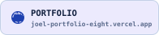

  <picture>
    <source media="(prefers-color-scheme: dark)" srcset="assets/profile-dark.svg" />
    <source media="(prefers-color-scheme: light)" srcset="assets/profile-light.svg" />
    
  </picture>

  <a href="https://github.com/JoelDlima" target="_blank" rel="noopener noreferrer">
    <picture>
      <source media="(prefers-color-scheme: dark)" srcset="assets/cards/github-dark.svg" />
      
    </picture>
  </a>
  <a href="https://www.linkedin.com/in/joel-dlima/" target="_blank" rel="noopener noreferrer">
    <picture>
      <source media="(prefers-color-scheme: dark)" srcset="assets/cards/linkedin-dark.svg" />
      
    </picture>
  </a>
  <a href="mailto:joeldlima123@gmail.com">
    <picture>
      <source media="(prefers-color-scheme: dark)" srcset="assets/cards/gmail-dark.svg" />
      
    </picture>
  </a>
  <a href="https://joel-portfolio-eight.vercel.app/work" target="_blank" rel="noopener noreferrer">
    <picture>
      <source media="(prefers-color-scheme: dark)" srcset="assets/cards/portfolio-dark.svg" />
      
    </picture>
  </a>

