<!-- 
  ╔══════════════════════════════════════════════╗
  ║         JOEL D'LIMA — GitHub Profile         ║
  ║    Electronics & Computer Engineering '27    ║
  ╚══════════════════════════════════════════════╝
-->

 

  
  
  
  

 

---

### 👋 About Me

> **Electronics & Computer Engineering** student (CGPA **9.7**) at Agnel Institute of Technology & Design, Goa.
> 4 months of startup experience + incoming **Visteon** internship.
> I build across the stack — from **ESP32 firmware** to **React dashboards** to **AI-powered pipelines**.

 

 

<b>📂 More Projects (click to expand)</b>

 

| Project | Description | Tech | Link |
|---------|------------|------|------|
| **Palliative Care** | Remote patient monitoring with SpO2, heart rate, ECG, fall detection | ESP32, IoT, Python, Cloud | Private |
| **MindCare** | Mental health platform — Team Nexus | TypeScript, React, Supabase | [Repo](https://github.com/NamanGaonkar/MindCare_TeamNexus) |
| **RoadSOS** | Emergency road assistance platform | TypeScript, React | [Repo](https://github.com/Spacey6849/RoadSOS) |
| **OdooHackathon** | DayFlow — productivity suite hackathon project | TypeScript, React | [Live](https://dayflow-silk.vercel.app) |
| **Medieval Translator** | Old English translator powered by Gemini AI | Python, Gemini API | [Live](https://medieval-translator-app.vercel.app) |
| **ESP32 Project** | Embedded systems project collection | C++, ESP32 | [Repo](https://github.com/JoelDlima/esp32_project) |

 

 

 

---

### 📊 GitHub Stats

  
  

  

 

---

  
  
  
  

  

