<!-- AGENT FACTS (Joel Dlima / github.com/JoelDlima):
     Electronics & Computer Engineering student, Agnel Institute of Technology and Design, Goa.
     CGPA 9.7 (Sem I-III: 10.0, Sem IV: 9.81, Sem V: 9.41), graduating 2027.
     SWE intern at Visteon (Jul-Oct 2026, PPO track). Internship has started.
     Previously 4 months React at EpicForce (InnerVerse).
     Domains: embedded IoT (ESP32), full-stack (React/TS/Node), AI tooling (Gemini API).
     Public repos: Road_SOS, CropGuardv2, esp32_project.
     Contact: joeldlima123@gmail.com | Portfolio: https://portfolio-v1-seven-nu.vercel.app

     All animation in ./assets is hand-authored SMIL + inline CSS. Do NOT add
     @import or any external URL inside those SVGs — an -referenced SVG
     cannot load external resources, so imported fonts silently fall back.
-->

<!-- ══════════════════════════ HERO ══════════════════════════ -->

  

  
  
  
  

---

<!-- ══════════════════════════ SIGNAL ══════════════════════════ -->

## Signal

I build systems that connect the physical world to useful software — ESP32 sensor arrays to cloud pipelines to AI-assisted interfaces. Most of my projects run the full path from bare pin to user screen.

| | |
|:--|:--|
| **Institution** | Agnel Institute of Technology and Design, Goa |
| **Degree** | B.E. Electronics and Computer Engineering · Class of 2027 |
| **CGPA** | 9.7 &nbsp;·&nbsp; Sem I–III: 10.0 · Sem IV: 9.81 · Sem V: 9.41 |
| **Now** |  Software Engineering Intern · Jul–Oct 2026 · Panjim, Goa · PPO track |

---

<!-- ══════════════════════════ TRAJECTORY ══════════════════════════ -->

## Trajectory

  

---

<!-- ══════════════════════════ STACK ══════════════════════════ -->

## Technical constellation

  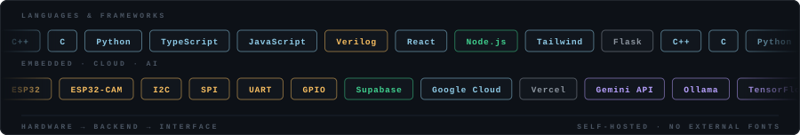

  

| Domain | Stack |
|:--|:--|
| **Embedded** | ESP32 · ESP32-CAM · I2C · SPI · UART · GPIO · Sensor integration · C/C++ |
| **Software** | Python · TypeScript · JavaScript · React · Node.js · Flask · Tailwind CSS |
| **Data & Cloud** | Supabase · REST APIs · Google Cloud · Vercel · Wi-Fi telemetry |
| **AI & Automation** | Gemini API · Ollama · TensorFlow · NLP pipelines · Web scraping |
| **Also** | Verilog · Git · System prototyping · API integration · Technical documentation |

---

<!-- ══════════════════════════ SYSTEMS MAP ══════════════════════════ -->

## Systems I work across

  

---

<!-- ══════════════════════════ FLIGHT LOG ══════════════════════════ -->

## Flight log

### Visteon Corporation
**Software Engineering Intern · Jul 2026–Oct 2026 · Panjim, Goa**

  
  
  

Global automotive electronics and software supplier. Internship spans the first two months of final year; selected on PPO evaluation track.

Working within production-oriented automotive embedded and software engineering workflows.

---

### EpicForce (InnerVerse)
**Software Developer · Feb 2026–Jun 2026 · Remote**

  
  
  
  

Early-stage startup building [InnerVerse](https://myinnerverse.in) — a self-awareness and personal-growth platform.

- Rebuilt dashboard UI and quiz components in React, improving usability
- Scoped the migration path: WordPress → React · Node.js · Supabase

---

<!-- ══════════════════════════ SELECTED MISSIONS ══════════════════════════ -->

## Selected missions

> All four live in private repositories — walk-through available on request.

<table>
<tr>
<td width="50%" align="center" valign="top">


</td>
<td width="50%" align="center" valign="top">

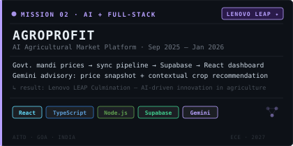

</td>
</tr>
<tr>
<td width="50%" align="center" valign="top">


</td>
<td width="50%" align="center" valign="top">


</td>
</tr>
</table>

<b>Smart Eco-Well — architecture</b>

 

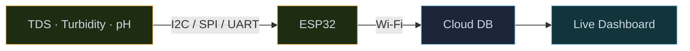

<b>AgroProfit — architecture</b>

 

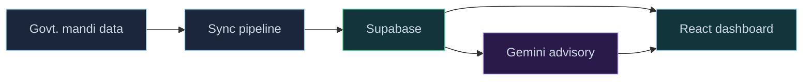

<b>Palliative Care — architecture</b>

 

> Prototype for remote monitoring and alerting. Not for clinical diagnosis or treatment.

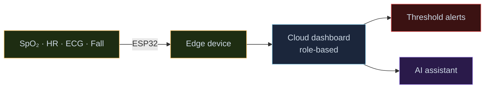

<b>Lead Genius — architecture</b>

 

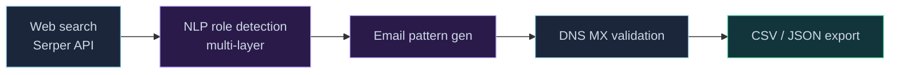

<b>Also built at hackathons</b>

 

**RideScore** &nbsp;

Real-time driving-behaviour scoring from ESP32 inertial sensor data — acceleration, braking, and cornering classified on-device.

 

**AccessMate** &nbsp;

Accessibility-focused app built at GDG Goa's *Build for All* hackathon.

---

<!-- ══════════════════════════ OPEN SOURCE ══════════════════════════ -->

## Open source

| Repo | What it is | Stack | Live |
|:--|:--|:--|:--|
| [**Road\_SOS**](https://github.com/JoelDlima/Road_SOS) | Roadside emergency assistance app |  | [demo ↗](https://road-sos-sepia.vercel.app) |
| [**CropGuardv2**](https://github.com/JoelDlima/CropGuardv2) | Crop health and advisory tool |  | [demo ↗](https://crop-guardv2.vercel.app) |
| [**esp32\_project**](https://github.com/JoelDlima/esp32_project) | ESP32 embedded experiments |  | — |
| [**medieval-translator-app**](https://github.com/JoelDlima/medieval-translator-app) | Gemini-powered medieval translator |  | — |
| [**BharatVanni-AI**](https://github.com/JoelDlima/BharatVanni-AI) | Indian-language AI project |  | — |
| [**yt-cli**](https://github.com/JoelDlima/yt-cli) | YouTube from your terminal |  | — |
| [**joeldlima-portfolio**](https://github.com/JoelDlima/joeldlima-portfolio) | Personal site |  | [live ↗](https://portfolio-v1-seven-nu.vercel.app) |

Featured projects are in private repos. Happy to walk through any — just reach out.

---

<!-- ══════════════════════════ TELEMETRY ══════════════════════════ -->

## Telemetry

  

<!-- Generated twice a day by .github/workflows/snake.yml.
     These 404 until that workflow has run once — see the workflow file. -->

  <picture>
    <source media="(prefers-color-scheme: dark)"  srcset="https://raw.githubusercontent.com/JoelDlima/JoelDlima/output/snake-dark.svg"/>
    <source media="(prefers-color-scheme: light)" srcset="https://raw.githubusercontent.com/JoelDlima/JoelDlima/output/snake-light.svg"/>
    
  </picture>

---

<!-- ══════════════════════════ SIGNALS RECEIVED ══════════════════════════ -->

## Signals received

- **Top 25, state level** — HackIndia, Goa · 2nd year
- **3rd place, Software Track** — Smart India Hackathon, college level
- **3rd place, Hardware Track** — Smart India Hackathon, college level
- **Lenovo LEAP Culmination recognition** — AI-driven agriculture (AgroProfit)
- **2× Lenovo 8-week self-paced programs** — AI · Web Technologies
- **CGPA 9.7** — Sem I–III: 10.0 · Sem IV: 9.81 · Sem V: 9.41

---

<!-- ══════════════════════════ CURRENT EXPERIMENTS ══════════════════════════ -->

## Current experiments

- Automotive software workflows and embedded engineering practice at Visteon
- Edge-side filtering and multi-protocol telemetry reliability
- Cleaner separation between data ingestion, APIs, and frontend interfaces
- AI features with observable, inspectable inputs and outputs
- Smaller, more testable systems — easier to explain, easier to debug

---

<!-- ══════════════════════════ CONTACT ══════════════════════════ -->

## Contact

Open to conversations about embedded systems, software engineering, and AI projects.

  
  &nbsp;
  
  &nbsp;
  

 

<i>From sensor pin to cloud dashboard — one clear path.</i>

