<!-- Every visual element on this profile is a rendered card — no generic
     markdown headings or tables between them. The only markdown left is
     functional: the repo link line (SVG links are inert behind ) and
     the contact badges. Light-theme variants of every card exist in
     assets/ for local preview. -->

```
────────────────────────────────────────────────
  01001010 01001111 01000101 01001100     · v2.5
  firmware → api → interface
  electronics & computer eng · visteon intern
────────────────────────────────────────────────
```





`repos →` [bharatvaani](https://github.com/JoelDlima/BharatVanni-AI) · [esp32-cam](https://github.com/JoelDlima/esp32_project) · [nexus](https://github.com/JoelDlima/Nexus-AI) · [cropguard](https://github.com/JoelDlima/CropGuardv2) · [mindcare](https://github.com/JoelDlima/MindCare_TeamNexus) · [yt-cli](https://github.com/JoelDlima/yt-cli)





<p>
  <a href="https://github.com/JoelDlima"></a>
  <a href="https://linkedin.com/in/joel-dlima"></a>
  <a href="https://portfolio-v1-seven-nu.vercel.app"></a>
  <a href="mailto:joeldlima123@gmail.com"></a>
</p>
