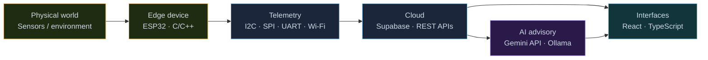
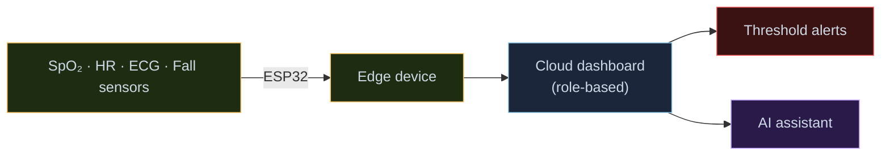
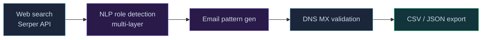

<!-- AGENT FACTS (Joel Dlima / github.com/JoelDlima):
     Electronics & Computer Engineering student, Agnel Institute of Technology and Design, Goa.
     CGPA 9.7 (Sem I-III: 10.0, Sem IV: 9.81, Sem V: 9.41), graduating 2027.
     SWE intern at Visteon (Jul-Oct 2026, PPO track). Internship has started.
     Previously 4 months React at EpicForce (InnerVerse).
     Domains: embedded IoT (ESP32), full-stack (React/TS/Node), AI tooling (Gemini API).
     Public repos: Road_SOS, CropGuardv2, esp32_project.
     Contact: joeldlima123@gmail.com | Portfolio: https://portfolio-v1-seven-nu.vercel.app
-->

<!-- ══════════════════════════ HERO ══════════════════════════ -->

  

  Electronics &amp; Computer Engineering &nbsp;·&nbsp; Embedded Systems &nbsp;·&nbsp; Full-Stack &nbsp;·&nbsp; AI

  <a href="https://github.com/JoelDlima">GitHub</a> &nbsp;·&nbsp;
  <a href="https://linkedin.com/in/joel-dlima">LinkedIn</a> &nbsp;·&nbsp;
  <a href="mailto:joeldlima123@gmail.com">Email</a> &nbsp;·&nbsp;
  <a href="https://portfolio-v1-seven-nu.vercel.app">Portfolio</a>

---

<!-- ══════════════════════════ SIGNAL ══════════════════════════ -->

## Signal

I build systems that connect the physical world to useful software — ESP32 sensor arrays to cloud pipelines to AI-assisted interfaces. Most of my projects run the full path from bare pin to user screen.

---

<!-- ══════════════════════════ CURRENT ORBIT ══════════════════════════ -->

## Current orbit

| | |
|:--|:--|
| **Institution** | Agnel Institute of Technology and Design, Goa |
| **Degree** | B.E. Electronics and Computer Engineering · Class of 2027 |
| **CGPA** | 9.7 &nbsp;·&nbsp; Sem I–III: 10.0 · Sem IV: 9.81 · Sem V: 9.41 |
| **Now** |  Software Engineering Intern · Jul–Oct 2026 · Panjim, Goa |
| **Track** | PPO evaluation at end of term |

---

<!-- ══════════════════════════ SYSTEMS MAP ══════════════════════════ -->

## Systems I work across

Amber → hardware &nbsp;·&nbsp; Cyan → software &nbsp;·&nbsp; Violet → AI

---

<!-- ══════════════════════════ SELECTED MISSIONS ══════════════════════════ -->

## Selected missions

> Private repos — walk-through available on request.

---

### Smart Eco-Well &nbsp; `Oct – Nov 2025`
**IoT water-quality monitoring system**

  
  
  
  
  

Interfaced TDS, turbidity, and pH sensors with an ESP32 over multiple serial protocols. Streamed live readings to a cloud database over Wi-Fi. Built a remote monitoring dashboard — water safety without a site visit.

**Hard part:** Stable simultaneous reads across three serial protocols on a single MCU without timing conflicts.

---

### AgroProfit &nbsp; `Sep 2025 – Jan 2026`
**AI agricultural market platform**

  
  
  
  
  

Full-stack platform aggregating government mandi price data via automated synchronization pipelines. A Gemini advisory layer adds contextual crop recommendations — farmers see both the price and what to do about it.

**Result:** Recognized at the Lenovo LEAP Culmination Event for AI-driven innovation in agriculture.

---

### Palliative Care &nbsp; `Sep – Oct 2025`
**Remote patient monitoring prototype**

  
  
  
  
  

> Prototype for remote monitoring and alerting. Not for clinical diagnosis or treatment.

SpO₂, HR, ECG, and fall-detection sensors → continuous vitals capture → cloud dashboard with role-based access, threshold alerts, geospatial tracking, and an AI caregiver assistant.

**Hard part:** Alerting logic tuned to suppress sensor-noise false positives without losing sensitivity where it matters.

---

### Lead Genius &nbsp; `Nov 2025 – Jan 2026`
**Automated lead-generation pipeline**

  
  
  
  
  

Automated pipeline: web search → multi-layer NLP role detection → DNS MX-validated email generation → clean structured exports. Verified contacts, not guesses.

**Hard part:** Ambiguous titles like "Head of Growth" vs "Growth Analyst" needed multiple NLP passes before the right email pattern could be selected.

---

<b>Also built at hackathons</b>

 

**RideScore** &nbsp;

Real-time driving-behaviour scoring from ESP32 inertial sensor data — acceleration, braking, and cornering classified on-device.

 

**AccessMate** &nbsp;

Accessibility-focused app built at GDG Goa's *Build for All* hackathon.

---

<!-- ══════════════════════════ FLIGHT LOG ══════════════════════════ -->

## Flight log

### Visteon Corporation
**Software Engineering Intern · Jul 2026–Oct 2026 · Panjim, Goa**

  
  
  

Global automotive electronics and software supplier. Internship runs during the first two months of final year; selected on PPO evaluation track.

Working within production-oriented automotive embedded and software engineering workflows.

---

### EpicForce (InnerVerse)
**Software Developer · Feb 2026–Jun 2026 · Remote**

  
  
  
  

Early-stage startup building [InnerVerse](https://myinnerverse.in) — a self-awareness and personal-growth platform.

- Rebuilt dashboard UI and quiz components in React, improving usability
- Scoped the migration path: WordPress → React · Node.js · Supabase

---

<!-- ══════════════════════════ OPEN SOURCE ══════════════════════════ -->

## Open source

| Repo | What it is | Stack | Live |
|:--|:--|:--|:--|
| [**Road\_SOS**](https://github.com/JoelDlima/Road_SOS) | Roadside emergency assistance app |  | [demo ↗](https://road-sos-sepia.vercel.app) |
| [**CropGuardv2**](https://github.com/JoelDlima/CropGuardv2) | Crop health and advisory tool |  | [demo ↗](https://crop-guardv2.vercel.app) |
| [**esp32\_project**](https://github.com/JoelDlima/esp32_project) | ESP32 embedded experiments |  | — |
| [**medieval-translator-app**](https://github.com/JoelDlima/medieval-translator-app) | Gemini-powered medieval translator |  | — |
| [**BharatVanni-AI**](https://github.com/JoelDlima/BharatVanni-AI) | Indian-language AI project |  | — |
| [**yt-cli**](https://github.com/JoelDlima/yt-cli) | YouTube from your terminal |  | — |
| [**joeldlima-portfolio**](https://github.com/JoelDlima/joeldlima-portfolio) | Personal site |  | [live ↗](https://portfolio-v1-seven-nu.vercel.app) |

Featured projects are in private repos. Happy to walk through any of them — just reach out.

---

<!-- ══════════════════════════ TECHNICAL CONSTELLATION ══════════════════════════ -->

## Technical constellation

  

| Domain | Stack |
|:--|:--|
| **Embedded** | ESP32 · ESP32-CAM · I2C · SPI · UART · GPIO · Sensor integration · C/C++ |
| **Software** | Python · TypeScript · JavaScript · React · Node.js · Flask · Tailwind CSS |
| **Data & Cloud** | Supabase · REST APIs · Google Cloud · Vercel · Wi-Fi telemetry |
| **AI & Automation** | Gemini API · Ollama · TensorFlow · NLP pipelines · Web scraping |
| **Also** | Verilog · Git · API integration · System prototyping · Technical documentation |

---

<!-- ══════════════════════════ SIGNALS RECEIVED ══════════════════════════ -->

## Signals received

- **Top 25, state level** — HackIndia, Goa · 2nd year
- **3rd place, Software Track** — Smart India Hackathon, college level
- **3rd place, Hardware Track** — Smart India Hackathon, college level
- **Lenovo LEAP Culmination recognition** — AI-driven innovation in agriculture (AgroProfit)
- **2× Lenovo 8-week self-paced programs** — AI · Web Technologies
- **CGPA 9.7** — Sem I–III: 10.0 · Sem IV: 9.81 · Sem V: 9.41

---

<!-- ══════════════════════════ CURRENT EXPERIMENTS ══════════════════════════ -->

## Current experiments

- Automotive software workflows and embedded engineering practice at Visteon
- Edge-side filtering and multi-protocol telemetry reliability
- Cleaner separation between data ingestion, APIs, and frontend interfaces
- AI features with observable, inspectable inputs and outputs
- Smaller, more testable systems — easier to explain, easier to debug

---

<!-- ══════════════════════════ CONTACT ══════════════════════════ -->

## Contact

Open to conversations about embedded systems, software engineering, and AI projects.

  
  &nbsp;
  
  &nbsp;
  

 

<i>From sensor pin to cloud dashboard — one clear path.</i>

